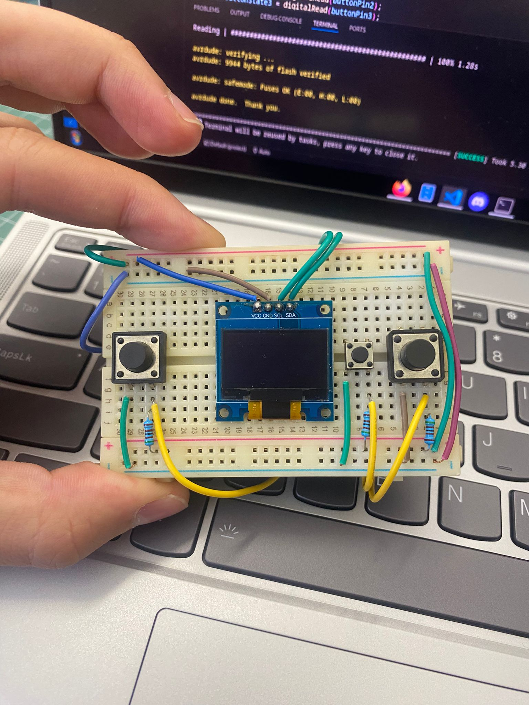
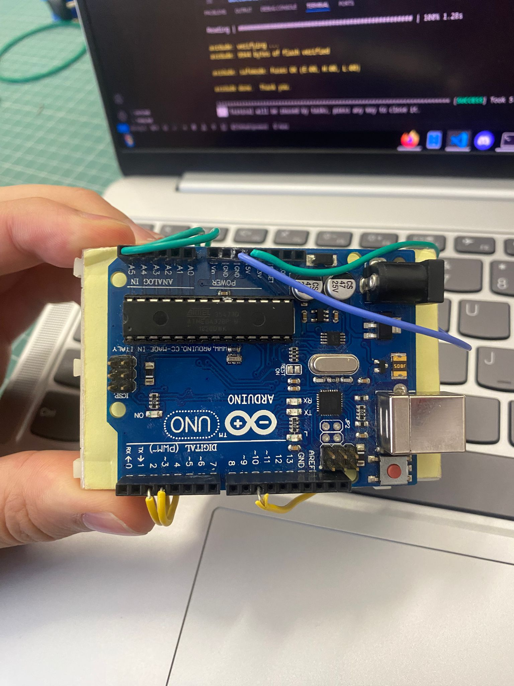

# Racing Brick Game

## Introduction
This project represent a game from old brick (yellow colorway ofc) that i played i a lot when i was 7 years old, being hospitalized. 
The Racing Brick Game is an interactive and nostalgic game designed using an Arduino microcontroller that mimics the classic handheld brick games popularized in the early 2000s. 

My project recreates a version of the brick "racing" game, where the player must control a moving block and avoid obstacles while racing toward a high score. The game is not complicated at all, it consists of moving a car left/right without hitting enemy cars approaching you.

This project integrates hardware and software components, demonstrating the versatility of Arduino for game development. By using a 128x64 OLED Y&B screen,buttons, and Arduino logic, the game renders visuals similar to the iconic monochrome blocks seen in classic brick games.
## General Description

### Modules and Components
- **Arduino**: The Arduino acts as the interface between hardware components and software instructions.
- **Small Breadboard**: The breadboard organizes connections and serves as a bridge for components to communicate electrically.
- **OLED Y&B Display I2C 0.96" 128x64**: The crisp, pixel-based graphics on the OLED provide a nostalgic and clear gaming experience similar to retro brick games.
- **Buttons**: Used for player input, such as movement and control actions in the game. They are configured with internal pull-up resistors to simplify the circuit and reduce external components.
- **Wires**: Use of wires ensures reliable communication and power delivery between all parts of the system.

### Connection Interfaces
- **OLED Y&B Display I2C 0.96" 128x64**: Connected to the Arduino via the I2C interface (SDA - A4 and SCL - A5).
- **Buttons** : One side of the button connects to an Arduino digital pin (D2, D3, D10) and the other side of the button connects to GND.

## Hardware Design
### Wokwi Simulation

### Electric Diagram

### Component list
- 1x Arduino Uno
- 1x Breadboard
- 1x Oled I2C Display 128x64
- 3x PullUp Buttons
- Connecting wires
- 3x 1k ohm Rezistors

| Component                | Connected Pins           |
|--------------------------|--------------------------|
| **Arduino Uno R3**        | GND, 5V, A5 (SCL), A4 (SDA),2 (Button 1), 3 (Button 2), 10 (Button3) |
| **OLED Y&B Display (128x64, I2C)**| SCL (A5), SDA (A4), VCC, GND |
| **Button 1**              | VCC, GND, Pin 2 |
| **Button 2**              | VCC, GND, Pin 3 |
| **Button 3**              | VCC, GND, Pin 10 |

## Software Design
The software implementation for the Racing Brick Game is developed using the Arduino platform and C++ programming. 
### Libraries and 3rd-Party Sources Used

The following libraries and resources were utilized in this project to enhance functionality and simplify development:

1. **Adafruit GFX Library**  
   - Provides a core set of graphics functions for drawing shapes, text, and bitmaps on a variety of displays.
   - Used to drawthe game elements such as the car, obstacles, road lines, and to score display on the OLED screen.
   - `source`: [Adafruit GFX Library on GitHub](https://github.com/adafruit/Adafruit-GFX-Library)  
  

2. **Adafruit SSD1306 Library**  
   - A library for controlling SSD1306-based OLED displays via I2C or SPI.
   - Used for initializing and managing the 128x64 OLED display, including sending commands and rendering the game interface.
   - `source`: [Adafruit SSD1306 Library on GitHub](https://github.com/adafruit/Adafruit_SSD1306)  
   
3. **Wire Library (Built-In)**  
   - A built-in Arduino library for I2C communication.  
   - `source`: pre-installed

4. **Arduino Core**  
   - The core Arduino framework that provides the fundamental functions (`setup`, `loop`, `pinMode`, `digitalRead`, etc.).  
   - `source`: [Arduino Core](https://www.arduino.cc/en/software)  

## Results 

## Conclusions

[oled_datasheet](img/oled_datasheet.pdf)

