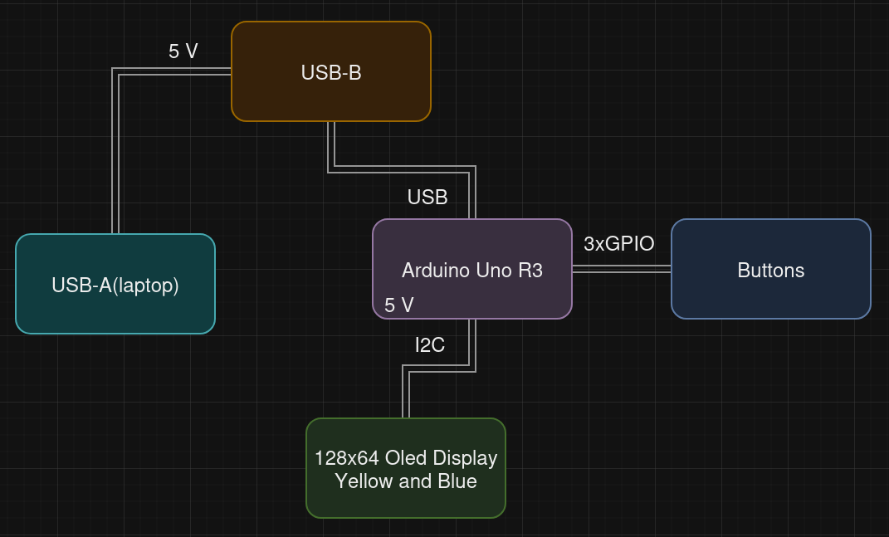
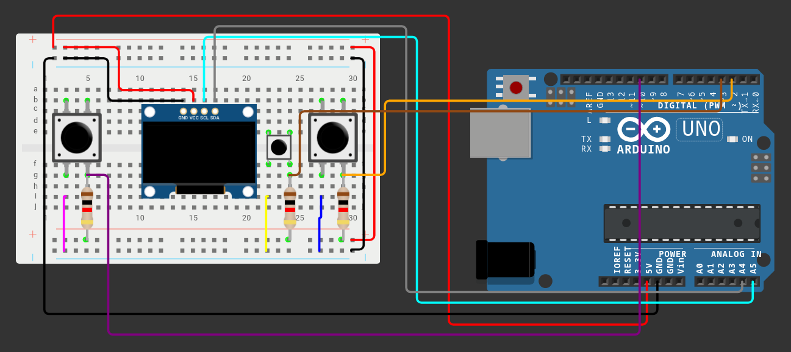
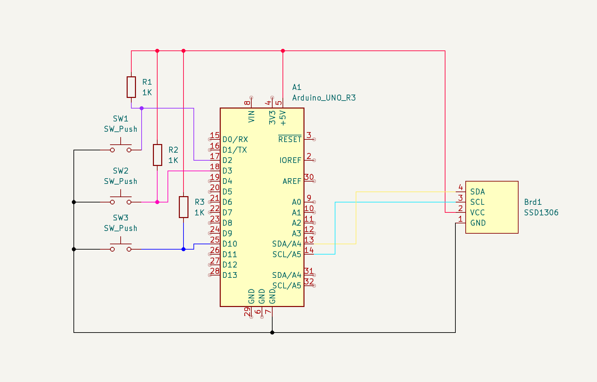

# Racing Brick Game

## Introduction
This project represent a game from old brick (yellow colorway ofc) that i played i a lot when i was 7 years old, being hospitalized. 
The Racing Brick Game is an interactive and nostalgic game designed using an Arduino microcontroller that mimics the classic handheld brick games popularized in the early 2000s. 

My project recreates a version of the brick "racing" game, where the player must control a moving block and avoid obstacles while racing toward a high score. The game is not complicated at all, it consists of moving a car left/right without hitting enemy cars approaching you.

This project integrates hardware and software components, demonstrating the versatility of Arduino for game development. By using a 128x64 OLED Y&B screen,buttons, and Arduino logic, the game renders visuals similar to the iconic monochrome blocks seen in classic brick games.
## General Description

## Hardware Design
### Component list

- 1x Arduino Uno
- 1x Breadboard
- 1x Oled I2C Display 128x64
- 3x PullUp Buttons
- Connecting wires
- 3x 1k ohm Rezistors

## Software Design

## Results 

## Conclusions
